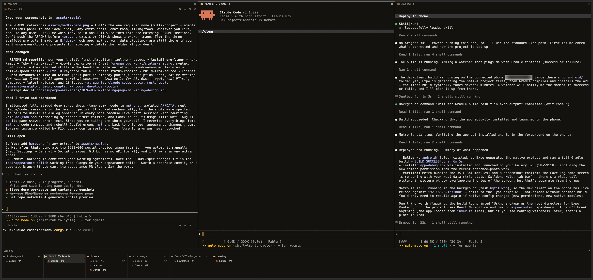
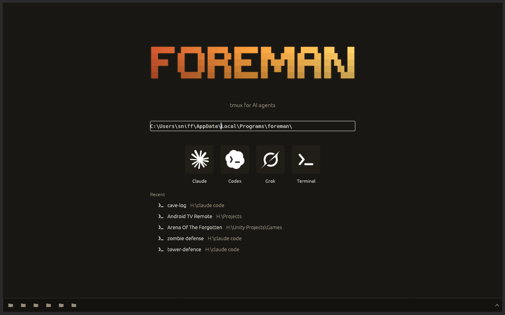
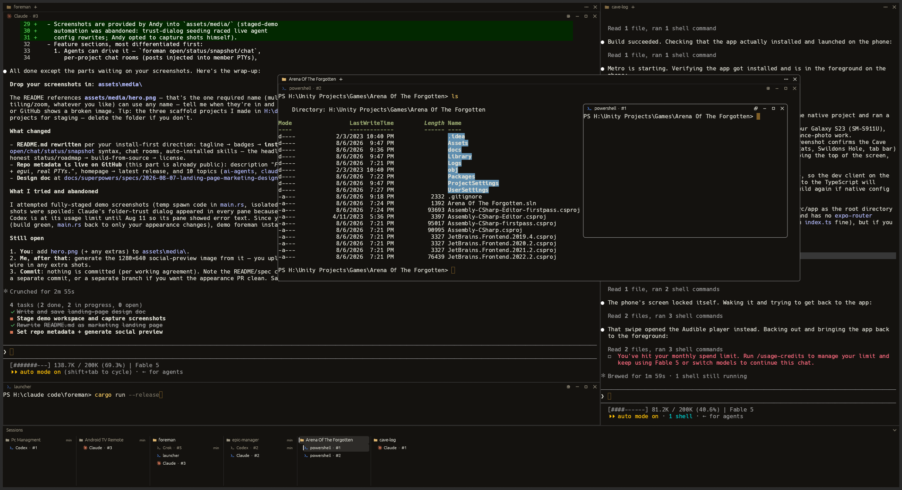

# Foreman

**A fast, native desktop for running fleets of AI coding agents — think tmux, built for AI.**

[](https://github.com/sniffle6/foreman/releases/latest)
[](LICENSE-MIT)


## Install (Windows)

One line, no admin, no wizard:

```powershell
irm https://raw.githubusercontent.com/sniffle6/foreman/main/install.ps1 | iex
```

Installs the [latest release](https://github.com/sniffle6/foreman/releases/latest)
to `%LOCALAPPDATA%\Programs\foreman` and adds it to your user PATH. Re-run the
same line to update — foreman also shows a quiet chip in the Sessions panel when
a new version is out. Prefer manual? Grab the zip from the
[releases page](https://github.com/sniffle6/foreman/releases).



## Why this exists

You're running five coding agents across three repos. Terminal tabs hide four
of them. A generic tiling setup doesn't know one project from another. Foreman
is a native desktop where **each project is a window, and each project contains
its own tiling workspace of terminals** — watch every agent at once, never lose
one behind a tab, and keep each project's panes sandboxed together.

It's also built agent-first: the agents *inside* foreman can open new
terminals, message each other, and read each other's screens.

## Start in about five seconds



Type or paste a folder, pick your agent, go — Claude, Codex, Grok, or a plain
shell. Recents are one keystroke away, and the whole screen is keyboard-driven.
Your last workspace is restored on the next launch.

## Agents can drive it

Every terminal foreman spawns gets a `foreman` CLI wired back to the app, plus
env vars (`FOREMAN=1`, project/terminal ids) so agents know where they are:

```powershell
foreman open --title tests -- claude "run the test suite and fix what breaks"
foreman chat "backend endpoints are yours; I'll take the UI"
foreman chat --history 20
foreman status
foreman snapshot --terminal t4
```

- **Dispatch** — an agent (or you, from any pane) spawns a worker in a new
  visible terminal and keeps working.
- **Chat rooms** — each project has a chat room; posts are *typed into* member
  agents' terminals (push, not poll), so a team of agents can divide work in
  one room. A read-only viewer pane shows the log.
- **Screens are readable** — `snapshot` returns any terminal's rendered
  viewport, so an agent can check on a worker without touching it.
- **Skills auto-installed** — on first launch foreman installs
  `foreman-dispatch` / `foreman-chat` skills into Claude Code and Codex, so
  agents discover all of this on their own.

## A window manager for projects

- Projects are top-level windows; inside each one is a full nested tiling
  window manager of terminals (same engine, recursively).
- **Tiling tree + floating**: drag a pane's header to tear it out; drop hints
  re-insert it as a split or a tab. New panes tile by default.
- **Tabs at both levels** — projects tab with projects, terminals with
  terminals.
- **tmux-style zoom**: one key makes a pane full-area; the layout underneath is
  untouched.
- **Sessions panel**: every project and every agent session across all of them,
  in one glanceable list at the edge.
- Fully keyboard-driven via a leader key (`Ctrl+B` by default, rebindable in
  the in-app settings).



Tiles are not a cage: pull any project or terminal out into a floating window
that stays on top, at either level — a project floating over the desktop, a
terminal floating inside its project — then drop it back into the tree when
you're done.

## A real terminal, at native speed

Rust + egui, real Windows PTYs (ConPTY), and `alacritty_terminal` emulation —
not Electron, not a web view. Claude Code, Codex, vim, lazygit, and less all
render correctly: truecolor, real bold/italic faces, mouse reporting,
bracketed paste, scrollback search (`Ctrl+F`), drag-to-select with standard
copy/paste. Instant open, no input lag, no stutter under heavy agent output —
lag in a tool like this is disqualifying, which is why it's native.

## Keyboard

Press the leader (`Ctrl+B`), then:

| Key | Action |
| --- | --- |
| `← ↑ ↓ →` | move focus between panes |
| `W A S D` | move the pane within the layout |
| `Alt+W/A/S/D` | split a new terminal in that direction |
| `C` | new terminal |
| `Z` | zoom pane (tmux-style) |
| `F` | float / re-tile |
| `Shift+P` | new project |
| `Ctrl+Tab` | last project |
| `?` | every binding (all rebindable in-app) |

## Status

Early and moving fast (v0.2.x). Windows today; the terminal stack
(`portable-pty` + `alacritty_terminal`) is cross-platform, so other platforms
are a roadmap item, not a rewrite. Browser panes inside projects are on the
roadmap too.

## Building from source

```powershell
cargo run --release
```

Windows builds use the GNU toolchain + the w64devkit linker. Start with
[`docs/HANDOFF.md`](docs/HANDOFF.md) — architecture, the build/verify loop, and
the gotchas — before substantial changes.

## License

Licensed under either of [Apache License 2.0](LICENSE-APACHE) or
[MIT license](LICENSE-MIT) at your option. Bundled third-party components keep
their own licenses (Hack font: `assets/fonts/LICENSE-Hack.md`; ConPTY:
`assets/conpty/LICENSE`).
